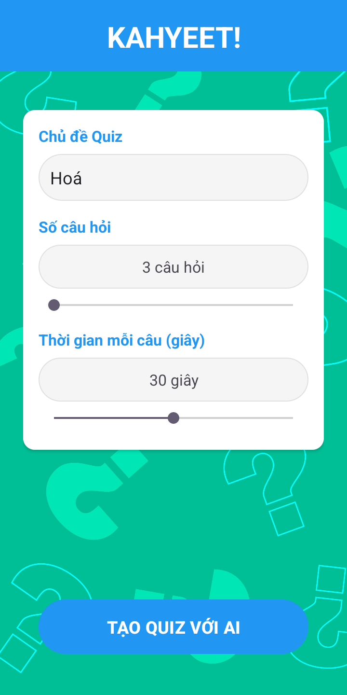
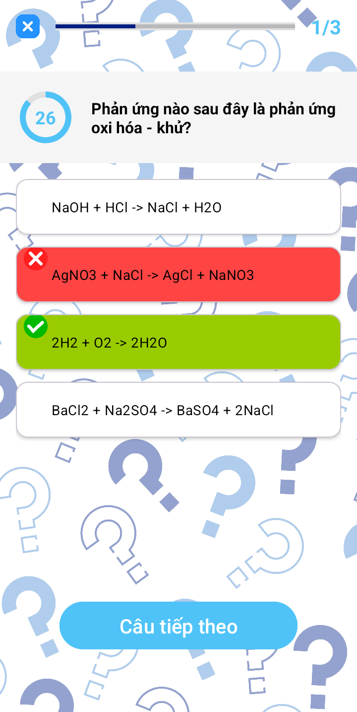
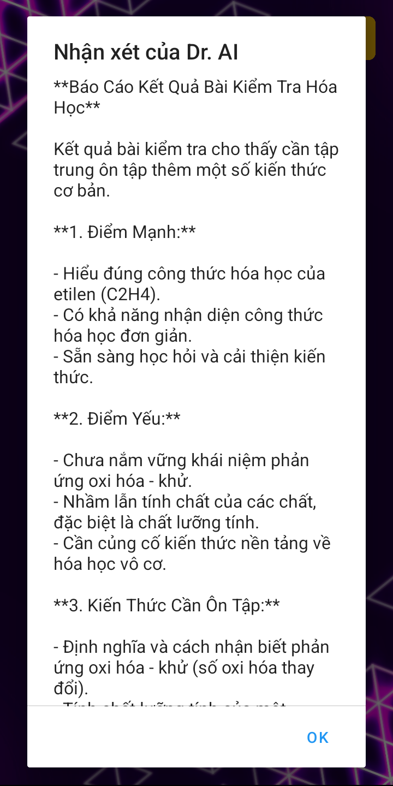

# 📱 KAHYEET! - Ứng dụng Trắc nghiệm kết hợp AI

**KAHYEET!** là ứng dụng trắc nghiệm học tập hiện đại, cho phép người dùng tạo bài kiểm tra theo chủ đề tuỳ chọn. Bài làm được chấm tự động và phân tích bằng AI (Gemini), đưa ra phản hồi chi tiết về điểm mạnh, điểm yếu và gợi ý học tập. Ứng dụng được phát triển dành cho nền tảng Android với giao diện hiện đại, trực quan.

---

## 🚀 Tính năng nổi bật

- 🎯 Tạo đề trắc nghiệm bằng AI theo chủ đề bất kỳ
- ⏱️ Hẹn giờ từng câu hỏi và hiển thị tiến trình
- ✅ Hiển thị đáp án đúng sau mỗi câu
- 🏁 Màn hình kết quả sinh động
- 🤖 Nhận xét thông minh từ AI: đánh giá, gợi ý học tập
- 🖼️ Giao diện sinh động, thân thiện người dùng

---

## 🖼️ Giao diện ứng dụng

| Màn hình chính | Màn hình loading | Màn hình câu hỏi |
|----------------|------------------|------------------|
|  |  |  |

| Màn hình kết quả | Phân tích AI |
|------------------|---------------|
|  |  |

---

## 🧠 Công nghệ sử dụng

- **Ngôn ngữ:** Java
- **Nền tảng:** Android Studio
- **Giao tiếp API:** Gemini 2.0 Flash (Google Generative Language API)
- **Giao diện động:** Custom selector, circular progress, popup feedback
- **Xử lý dữ liệu:** Parcelable, AsyncTask

---

## ⚙️ Hướng dẫn sử dụng

1. **Clone repository** về máy:
   ```bash
   git clone https://github.com/tenban/kahyeet.git
   ```

2. **Mở bằng Android Studio**

3. **Thêm API Key**:
   - Mở file `GeminiApi.java`
   - Thay thế API key bằng key của bạn từ [Google AI Studio](https://makersuite.google.com/) vào biến GEMINI_API_KEY

4. **Build và chạy ứng dụng**

---

## 📋 Yêu cầu hệ thống

- Android 14.0 (API level 34 - "UpsideDownCake")
- Android Studio

---

## 📜 Giấy phép

Dự án được phát hành theo giấy phép MIT. Vui lòng xem file `LICENSE` để biết thêm chi tiết.

---

## 👤 Tác giả

© 2025 - Phát triển bởi **Eggpant203** 🍆

---

_Lưu ý: Dự án dùng để học tập và tham khảo về cách xây dựng ứng dụng Android kết hợp AI (Gemini API) để tạo nội dung và phân tích kết quả trắc nghiệm._